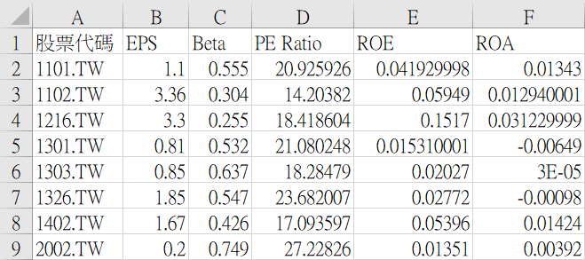
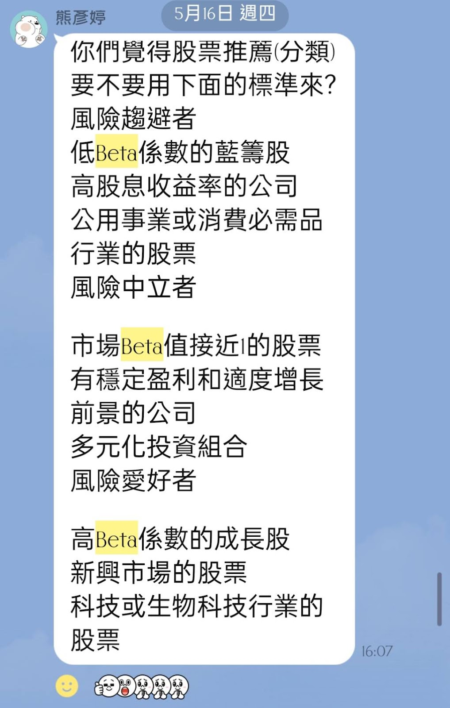
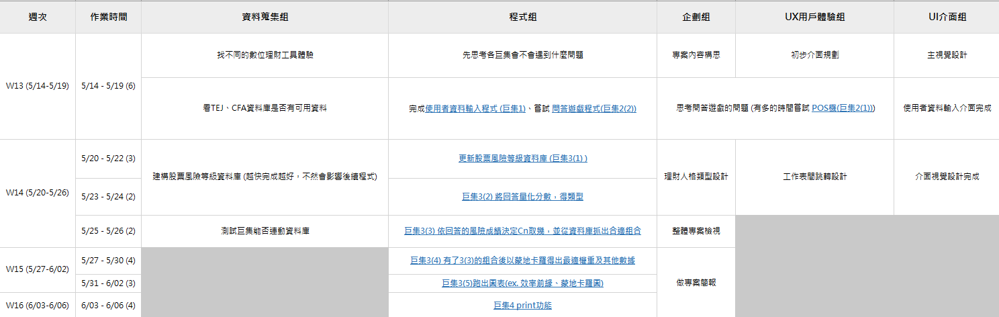
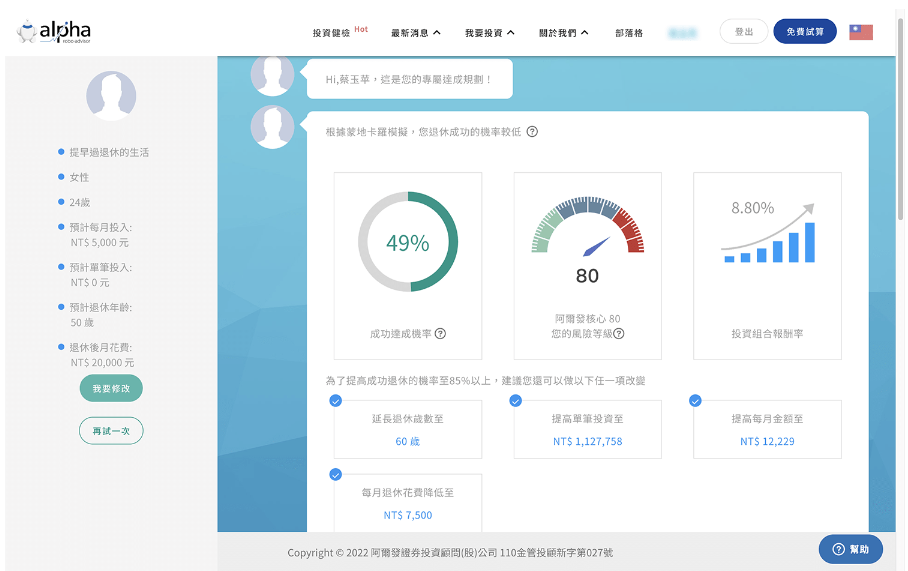
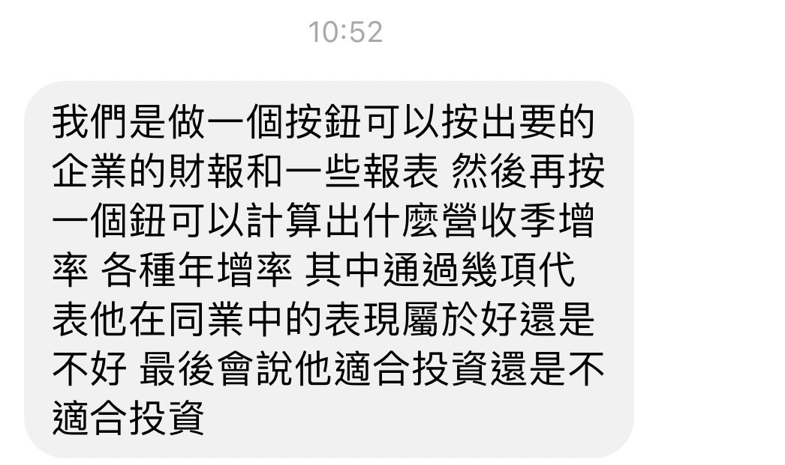

# 2024/05/19(日) 期末衝進度01

## 郭宸惟

### 舊任務：

1. 先想主視覺（風格、顏色）
2. 目前已知主要有四張工作表，可以先大概思考如何規劃版面
3. 跟龍哥可以先處理使用者輸入個人資料的程式和視覺（看影片）
4. 想一下UI需要多少人力、如何分類

---

筆記區：

https://drive.google.com/file/d/1K0hGggz1D1HwZAVMezz74aEZtf3punWG/view?usp=sharing

不知道是甚麼風格，但想要活潑又不過分複雜，黃色、橘色、黑色。

by 伊婷:

好喜歡&lt;3

**主視覺是 <span style="text-decoration:underline;">早晨/太陽/晴天 </span>的話，看人格類型要不要跟著設計** 

**( ex.黃昏型、黎明型、正午型、夜晚型、清晨型...etc. || 太陽、星星、月亮...etc. || 陽光普照、陰雨綿綿、大雨傾盆...etc. )**

---


### 新任務：

* 可以先跟龍哥動工 **<span style="text-decoration:underline;">POS機</span>** 介面與程式 (參影片，底下有教材可以直接取用)
* 等宜靜先修完UX介面，開始初步設計不同工作表
* 等熊設計好理財人格(問題可以先緩)，開始設計圖像(PNG檔)

---

## 龍翔翌

### 舊任務：

1. 跟宸惟先處理使用者輸入個人資料的程式
2. 程式的部分都可以先想想看

---

筆記區：

**by 伊婷:**

1. **初步構想的程式功能可以看 5/14【使用步驟】-【所有大功能內容】、【使用者看到的內容(按鈕)】**
2. **使用者輸入介面的【確認送出按鈕】有兩個功能**

    1. 送出資料到  <span style="text-decoration:underline;">結果頁面(工作表4) </span>的左或右上角


    2. 跳到 <span style="text-decoration:underline;">POS機(工作表2) </span>的畫面

---

### 新任務：

* 可以先跟宸惟動工 **<span style="text-decoration:underline;">POS機</span>** 的程式
* 看看[跳轉Python更新股票風險資料庫](https://colab.research.google.com/drive/179QKpTTuE2qq69T03N6amRIEGIcGCH4m#scrollTo=jT0e1V-b4jVC)有沒有更好的做法(如果能直接用Excel VBA最好)
* 嘗試看看各個程式，想想可能會遇到什麼問題

---

## 林睿駿

### 舊任務：

1. 瞭解問答遊戲模式(有時間可以先動程式)
2. 思考前端企劃內容(可打在[這裡](https://www.canva.com/design/DAGEQRdiZL8/_ID6DWorZp3FK2B4UfmiKA/edit))

---

筆記區：

**by 伊婷:**

**我目前比較不確定的是還能不能像問答遊戲的形式操作 <span style="text-decoration:underline;">(先給大家看一下初版UX)</span>**

**前端目前已完成使用者輸入介面，接下來要完成POS機(股票庫和理財人格設計、情境問題同步處理)**

---

### 新任務：

* 先支援問答的部分(目前主要是宜靜和熊)
* 有餘力協助風險庫規劃(目前主要是蕭宇辰和陳子鈞)
* 若他們都不需要幫助可以先開始動簡報文字

---

## 蕭宇辰

### 舊任務：

1. 先看看各個不同的數位理財(有[影片](https://www.youtube.com/watch?v=ZEBfbTXKl50)用影片，怕有免費限制)
2. 跟陳子鈞思考有哪些分析方式

---

筆記區：

**by 伊婷:**

**玩玩看不同的數位理財 ex. [阿爾發](https://carolblogtw.com/alpha-robo-advisor/)、[奈米投](https://nmplusinvestment.fubon.com/nmi-frontend/index.html)**

**目的是找到不同的分析方式當備案，避免我們有東西做不出來**

---

### 新任務：

* 下次開會大概說一下找到的分析方式
* 和陳子鈞想好股票庫的分類方法(可以的話我們這個要早點開始動工，包含程式)

---

## 陳子鈞


### 舊任務：

1. 跟蕭宇辰思考有哪些分析方式
2. 研究一下 TEJ 和 CFA 資料庫的可用資料

---

筆記區：

**by 伊婷:**

**設計較好的股票風險歸類方式**

**[參考檔案](https://docs.google.com/spreadsheets/d/1igoqmlEAGw3G8ejGAVfr74Zw8unIXiBj/edit?usp=drive_link&ouid=116889747184284999246&rtpof=true&sd=true)**

**[python連結](https://colab.research.google.com/drive/179QKpTTuE2qq69T03N6amRIEGIcGCH4m#scrollTo=jT0e1V-b4jVC)**





---


### 新任務：

* 下次開會大概說一下找到的分析方式
* 和蕭宇辰想好股票庫的分類方法(可以的話我們這個要早點開始動工，包含程式)

---

## 熊彥婷

### 舊任務：

1. 思考後端企劃內容(可打在[這裡](https://www.canva.com/design/DAGEQRdiZL8/_ID6DWorZp3FK2B4UfmiKA/edit))
2. 跟宜靜一起先思考問答部分的問題(先歸類情境)
3. (開始嘗試POS機或構想理財分類)

---

筆記區：

**by 伊婷:**

**派給熊的事情比較多(搜哩Q 上次說的很亂)**

**大概瞭解一下目前進度**

---

### 新任務：

* 優先設計理財人格的【名稱】和【特色】(文案)
* 設計情境問題(宜靜可以先處理)
* 幫資料蒐集組一起想一下股票庫分類方式(可以從人格對應的風險想如何分類)
* 想一下問題如何呈現(要直接用工作表還是上次查到的Userform)

---

## 蔡宜靜

### 舊任務：

1. 思考操作方便性(直接以Excel規劃位置)
2. 跟熊一起先思考問答部分的問題(先歸類情境)
3. (開始嘗試POS機或構想理財分類)

---

筆記區：

[初步UX設置](https://docs.google.com/spreadsheets/d/1C8Y7pgY4BtpHoIczZD8wfL5A4uxfCfwK/edit?usp=sharing&ouid=104769801411999619989&rtpof=true&sd=true)

**by 伊婷:**

**這份檔案人格都要改成情境 <span style="text-decoration:underline;">(以下六個 想問你們要不要改) </span>，六個情境出的問題不同(暫定固定六張工作表直接將問題設好再跳轉)，我們會把選項設定分數，以及再設定每個理財人格的分數區間，看看使用者的分數落在多少，得到他的理財人格。**

**每個理財人格有他的 <span style="text-decoration:underline;">風險股票庫對應值 </span>，確認對應值之後我們再從股票庫抽選適合的股票組出投資組合**

**並為該投資組合跑出模擬報酬和其他分析**


**問題的位置我覺得先這樣，<span style="text-decoration:underline;">想問熊有沒有其他設計想法? (改選單or其他)</span>**

**工作表4除了分析結果，希望左或右上角還能有一個 <span style="text-decoration:underline;">使用者資訊區 (使用者輸入個人資訊到時候回傳到這裡)</span>**

---


### 新任務：

* 修改目前的UX (見橘字)_盡快完成! 宸惟可依新版先設計界面
* 設計情境問題

---

## 蔣伊婷

### 舊任務：

1. 看有沒有辦法連動 Tableau 跟 Power BI 做視覺化
2. 企劃雛形

---

筆記區：

**<span style="text-decoration:underline;">五 10:50</span>**

**目前的規劃是**

1. **POS機程式與介面__  			宸惟龍哥**
2. **理財人格與情境問題設計__  		熊和林睿駿**
3. **風險庫規劃以及分析方式蒐集__  	蕭宇辰陳子鈞**
4. **支援與構想企劃__ 			宜靜和我**

***有沒有人不清楚自己要做什麼? 都可以問!***

**最新時程規劃**

**圖較晚完成，大家優先把這次派的任務盡量在下次開會完成就行**

---

### 新任務：

* 先試著嘗試不同程式
* 完成企劃雛形

---

# 2024/05/14(二) 期末專題架構

## 專案介紹

企劃檔案[https://reurl.cc/2Yz8ea](https://reurl.cc/2Yz8ea)

## 使用步驟

### 所有大功能內容

1. 使用者輸入個人資料(暱稱、年齡、性別...etc) -最後結果回傳(kyc)
2. 選擇POS機情境
3. 開始問答階段(約7-10個問題__可外建問題資料庫再亂數抽取) -用以分析投資人類型
4. 更新股票風險等級資料庫(爬PE Ratio或其他資訊)
5. 依照2.得到的回答和3.更新後的資料庫取得結果_什麼樣的投資人和對應的投資組合(10檔股票)
6. 跑出蒙地卡羅、圖表，以及其他分析

### 使用者看到的內容(按鈕)

1. 先看到 **個人資料輸入介面(工作表1) **，填完後按下**「完成」(按鈕1) **跳轉至**下個介面(工作表2)**
2. 來到**情境選擇環節(修改版POS機，工作表2)**，點選後跳轉到**問答介面(工作表3)**(注意這邊資料庫要依情境分類對應問題)
3. **問答介面(工作表3)**會顯示各項問題(可以一次全部顯示比較好做)，填答完後按**「取得結果」(按鈕2) **，填完後跳轉到**結果介面(工作表4)**，同時開始跑結果出來--
    1. 更新股票風險等級資料庫
    2. 跑出投資人類型
    3. 跑出推薦投資組合
    4. 跑出蒙地卡羅(最適權重 or 其他)
    5. 跑出圖表
    6. 其他分析
4. 可讓使用者選擇**印出成果**(可見[影片](https://www.youtube.com/watch?v=F4ntA-RIS10&t=53s))

## 分工

#### 各組任務

* 資料蒐集組 ★★★★☆
  1. 蒐集不同家數位理財功能，作為分析參考
  2. 尋找可分析資源，並思考合適分析方式
* 程式組 ★★★★★
  1. 前端([使用者資訊輸入](https://www.youtube.com/watch?v=YBsY4zyG73I)、問答遊戲、[POS機-情境設置](https://www.youtube.com/watch?v=F4ntA-RIS10&t=53s))
  2. 後端(各項分析，這邊可能需要UIUX組先將介面規劃好)
  3. 也許能有最後print出結果的功能
* 企劃組 ★★★★☆
  1. 構想整體專案內容(包含問答、分析，etc.) - 我會先打個大概再由你們接手，別擔心ouob
  2. 設計POS機情境
  3. 設計理財人格類型(可以MBTI、星座等為參考)
* UX用戶體驗組 ★★★☆☆
  1. 思考各工作表間頁面跳轉與方便性(包含按鈕如何跳轉)
  2. 初步規劃介面概要位置(可直接用Excel規劃儀錶板)
* UI介面組 ★★★☆☆
  1. 專案主視覺設計(風格、顏色，按鈕也可符合主視覺)
  2. 與UX組合作，做出最人性化(方便)的介面視覺


#### 以<span style="text-decoration:underline;">大組</span>分程式 　


**`。`代表有檔案可參考**


**Group 5**

使用者資料輸入

問答遊戲

生成圖表

(情緒分析)

(VaR?-衡量投資組合或資產在特定時間內可能面臨的最大潛在損失)

---

**Group 17**

投資組合推薦 

1. PE ratio或其他方式評估該股票是否適合投資(資訊看要用TEJ還是網頁資料抓)，將股票依風險分等(高中低)，以建資料庫
2. 依據使用者回答的問題取得風險對應，用Cn取幾的方式得出推薦選股(十檔)

蒙地卡羅(找出最適weight)

POS機

#### 以<span style="text-decoration:underline;">個別考量</span>分程式

使用者資料輸入 _ &nbsp;&nbsp;是初期的前端，也和介面有較大關係(見[影片](https://www.youtube.com/watch?v=YBsY4zyG73I))，宸惟和龍哥可先嘗試

問答遊戲_&nbsp;&nbsp;林睿駿提出來的想法，且跟前端企劃有關，可先嘗試

生成圖表_&nbsp;&nbsp;我想試試看能不能連動 Tableau 或 Power BI

(情緒分析)_	&nbsp;&nbsp;擔心API超上限要付費，有多的時間再做

(VaR)_&nbsp;&nbsp;我們不熟，要花多一點時間瞭解，但若能成功找出投資組合就可以用它分析

---

投資組合推薦_&nbsp;&nbsp;覺得是最難的程式之一，而跟資料和分析方式最相關，想先交給蕭宇辰和陳子鈞

蒙地卡羅_&nbsp;&nbsp;有範例的是找出最適投組和夏普率，看有沒有辦法深化(ex. 投資成功率?) 熊&蔡

POS機_&nbsp;&nbsp;熊提的，而且會跟情境企劃有關係 熊&蔡


#### 個人注意事項

**郭宸惟** 

#### 小任務：

1. 先想主視覺（風格、顏色）
2. 目前已知主要有四張工作表，可以先大概思考如何規劃版面
3. 跟龍哥可以先處理使用者輸入個人資料的程式和視覺（看影片）
4. 想一下UI需要多少人力、如何分類


筆記區：

1.想先找找看用excel做介面的教學影片或資料，用以尋找靈感（風格、配色、運作模式等等）。

2.關於UI需要多少人力，分類的問題不太清楚。

---

**龍翔翌**

#### 小任務：

1. 跟宸惟先處理使用者輸入個人資料的程式
2. 程式的部分都可以先想想看

筆記區：

---

**林睿駿**

#### 小任務：

1. 瞭解問答遊戲模式(有時間可以先動程式)
2. 思考前端企劃內容(可打在[這裡](https://www.canva.com/design/DAGEQRdiZL8/_ID6DWorZp3FK2B4UfmiKA/edit))

筆記區：

```
1. 你目前的年齡是？A. 20歲以下B. 21-30歲C. 31-40歲D. 41-50歲E. 51-60歲F. 60歲以上

2. 你的家庭狀況是？A. 單身B. 已婚，無子女C. 已婚，有子女D. 已退休

3. 你目前的工作狀況是？A. 在職B. 求職中C. 已退休D. 學生

4. 你每年的個人收入範圍是？A. 30萬以下B. 31-60萬C. 61-90萬D. 91-120萬E. 121-150萬F. 150萬以上

5. 你每年可以投資的金額範圍是多少？A. 10萬以下B. 11-50萬C. 51-100萬D. 101萬以上

6. 你的家庭總資產是多少？A. 100萬以下B. 101-500萬C. 501-1000萬D. 1001萬以上

7. 你的負債總金額是多少？A. 無負債B. 50萬以下C. 51-200萬D. 201-500萬E. 501萬以上

8. 你目前的投資經驗是？A. 沒有任何投資經驗B. 有過儲蓄或定存C. 有過股票或基金投資D. 有過衍生性產品投資

9. 你對投資風險的認識程度是？A. 完全不了解B. 有基本認知C. 了解大部分風險D. 完全瞭解

10. 你每次投資的金額通常占你年收入的比例為何？A. 10%以下B. 10-25%C. 26-50%D. 51-75%E. 75%以上

11. 你的投資期限通常為何？A. 1年以下B. 1-3年C. 3-5年D. 5年以上

12. 你希望的投資回報率為何？A. 3%以下B. 3-5%C. 6-10%D. 11-20%E. 20%以上

13. 資理財的目標是？A. 保本B. 籌劃未來的大筆支出C. 準備退休資金D. 提高收入

14. 預計何時會動用你的投資資產？A. 1年內B. 2-5年C. 6-10年D. 10年以上

15. 你希望投資方式為何？A. 自行投資B. 尋找專業理財顧問C. 透過銀行或證券公司的投資組合

16. 你何時會檢視你的投資組合？A. 每週B. 每月C. 每季D. 每年

17. 你面臨資產價值下跌20%的情況會如何？A. 對你來說是個問題，你可能會立即賣掉B. 你會觀察一下再做決定C. 你就算價值下跌也會繼續持有，相信會回升D. 你會視此為買入的好機會

18. 你的投資目標是？A. 打敗大盤B. 跟隨大盤的走向C. 獲取固定收入D. 最大化獲利

19. 你規劃投資的主要原因是什麼？A. 為退休賺取更多的金錢B. 為孩子未來的教育規劃C. 為大筆花費做準備，如購買房子或車子D. 提升生活品質

20. 你對風險的看法是什麼？A. 避免風險的投資B. 在必要時接受某程度的風險C. 為了獲取高報酬願意接受高風險D. 接受非常高的風險以獲取潛在的高報酬
```

---

**蕭宇辰**

#### 小任務：

1. 先看看各個不同的數位理財(有[影片](https://www.youtube.com/watch?v=ZEBfbTXKl50)用影片，怕有免費限制)
2. 跟陳子鈞思考有哪些分析方式

筆記區：

---

 **陳子鈞**

#### 小任務：

1. 跟蕭宇辰思考有哪些分析方式
2. 研究一下 TEJ 和 CFA 資料庫的可用資料

筆記區：

---

**熊彥婷**

#### 小任務：

1. 思考後端企劃內容(可打在[這裡](https://www.canva.com/design/DAGEQRdiZL8/_ID6DWorZp3FK2B4UfmiKA/edit))
2. 跟宜靜一起先思考問答部分的問題(先歸類情境)
3. (開始嘗試POS機或構想理財分類)

筆記區：

---

**蔡宜靜**

#### 小任務：

1. 思考操作方便性(直接以Excel規劃位置)
2. 跟熊一起先思考問答部分的問題(先歸類情境)
3. (開始嘗試POS機或構想理財分類)

筆記區：

**[初步UX設置](https://docs.google.com/spreadsheets/d/1C8Y7pgY4BtpHoIczZD8wfL5A4uxfCfwK/edit?usp=sharing&ouid=104769801411999619989&rtpof=true&sd=true)**

---

**蔣伊婷**

#### 小任務：

1. 看有沒有辦法連動 Tableau 跟 Power BI 做視覺化
2. 企劃雛形

筆記區：

---

## 初步時程安排 (6/06(四)報告)



---

# 構想-數位理財

**原因**

1. 不是所有人都擅長程式，盡量不主打單一功能（避免做不出來讓做程式的人太累）
2. 希望大家能在這次專案做擅長且有興趣的事
3. 功能可多可寡，進可攻退可守

<span style="text-decoration:underline;">借鑒阿爾發</span>

* 概要介紹：[https://carolblogtw.com/alpha-robo-advisor/](https://carolblogtw.com/alpha-robo-advisor/)
* 參考實際網站：（免費使用有期限限制）[https://roboadvisor.com.tw/](https://roboadvisor.com.tw/)

---

**分工**

* 財務（資訊蒐集）－參考各個機器人網站頁面(英文好可找國外的，看他們做了哪些分析)
* 企劃－構想投資情境、設計投資人格（可以參考MBTI、星座，包含文案和圖像設計）
* 程式－將所有後台的東西做出來
* 介面設計－也許可以將介面做的像網站
* 報告－簡報 & 口頭

【POS機】

(情境選擇) –


【跑出的結果】

蒙地卡羅(最適投資組合)

效率前緣圖(最適投資組合)

各式圖表(Maybe能連結 Power BI 或 Tableau做視覺化呈現)

簡易情感分析(連GPT API)，分析市場前景

其他統計分析(VaR?)



---

# 2024/05/07(二) 期末主題討論

## 金融類

1. **抓Yahoo股市資料(新聞)(類似情感分析)--判斷對市場前景的好壞**

(**API會限制次數**  問學長有沒有遇到類似問題)

2. **退休金規劃**



3. **問卷(調查使用者狀況 Maybe風險) – 投資組合**
4. **PE ratio**


5. CAPM(營再表--有點太難)

## 非金融類

1. 知識王遊戲(財經類問題)--
   - 可能連結到退休金規劃、問卷(ex. 以財經類問題評估用戶分數)

2. 隨機出題：托福英文單字、證照(問沛霖版權問題)
3. pos機(點餐機)    
   - 當成資料庫參考
